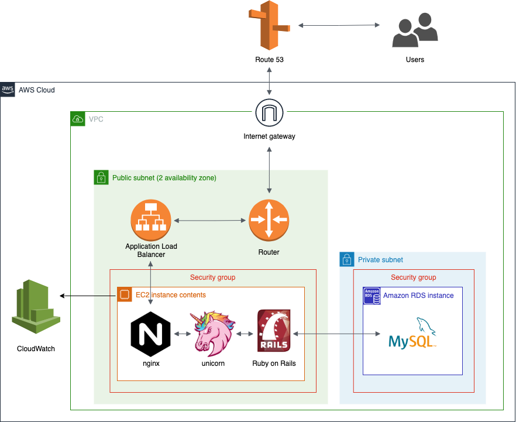

# アプリ概要

[入出荷管理アプリ](https://schedule-app.com "入出荷管理アプリ") 

石油精製工場における「入出荷の船受入れ（オーダー）」と「入出荷設備の工事」の日程を管理するためのアプリです。

このサービスでは
- 担当部署ごとにオーダーと工事の予定をカレンダーに登録・表示
- 登録データから、新たな予定登録を制限

することで、情報を可視化しスケジューリングのヒューマンエラーを防ぐ事ができます。
<!--
[利用シーン例 動画(1:26)](https://www.youtube.com/watch?v=y3dYltsLgz0&list=PLFu1xCObsLPNi-TWiEcojQtsqfrSXi_1q&index=2&t=0s)
※音が出ます。イヤホンが無い方はミュートしてご覧ください。

■ テストユーザーログインも可能ですので、自由にお試しください -->

# 使用技術・言語

- フロントエンド(Javascript, jQuery, HTML/CSS, Sass)
- バックエンド(Ruby on Rails)
- テスト(RSpec, FactoryBot, Capybara)
- Web サーバ(nginx, unicorn)
- データベース(MySQL)
- AWS(VPC, EC2, RDS for MySQL, Route53, ELB, CloudWatch, CLI)
- 開発環境(MacOS, VScode, Git, GitHub, bash)

# インフラ構成

# 機能要件

### 工事・オーダーの編集

- 工事予定の登録・編集・削除
- オーダーの登録・編集・削除
- カレンダーから登録・編集・削除も可

### 工事・オーダーの閲覧

- 工事予定の一覧表示
- オーダーの一覧表示
- 各項目によるキーワード検索・ソート・ＣＳＶ出力機能

### 工事へのコメント機能

- コメントの投稿・削除（Ajax）
- 長文コメントへのRead more機能

### カレンダー機能

- 週間・月間カレンダーで工事・オーダーを表示
- 日付クリックで新規工事またはオーダー登録

### ユーザ機能

- ユーザ情報 登録・編集・削除
- マイページ 登録した工事またはオーダー、および投稿コメントの一覧
- テストユーザログイン機能

### admin機能

- ユーザー・工事・オーダーを登録・編集・削除（Ajax）
- 入出荷設備の登録・編集・削除、取扱油種との関連付け
- ユーザー・工事・オーダー・入出荷設備の一覧表示
- 各項目によるキーワード検索・ソート・CSV出力機能

### UI

- フォーム空欄時に送信ボタンのdisable化
- ページネーション(kaminari) (各一覧画面)

# 非機能要件

- レスポンシブ対応
- エラーハンドリング
- HTTPS接続
- モデル/コントローラの単体テスト
- 統合テスト

# このアプリで解決したい課題

ジャムセッションは音楽を楽しむ上で、非常に重要だが、音楽初心者にとっての参加ハードルが高い。

## 詳細

### ジャムセッションに参加していくことで得られるメリット

0. 一緒に演奏する楽しさを気軽に味わえる ＝ Bluegrass 音楽の醍醐味
1. 合奏の回数が増えることで、上達スピードが向上
2. コミュニケーションのきっかけとなり、音楽仲間の輪が広がる

一方で、「やってみたい」「うまくなりたいからやる」と思っているものの、 
ハードルの高さから諦める方も多数いるのが現状の Bluegrass コミュニティの課題。

### 高いハードルの要因

- 曲を練習するために必要なコード進行(曲で使われている音階の流れ)の把握が困難
- １曲覚えるコストが高い上に初心者どうしだと知ってる曲が被らない…

### 解決する手法

- コード譜のデータを検索/閲覧できる機能
- 練習中/弾ける曲の集計により”超”メジャー曲を可視化
- コード譜の作成機能により最新トレンドにも対応

## リリース時の反響

# 使ってみよう

### コード譜を見つけよう

- トップページの検索窓に"Country Road"と入力し、Jam アイコンをクリックしてから、検索ボタンをクリック
- 検索結果に表示された"Country Road"をクリック。コード譜が表示されます
- ジャムしながら見たいときは"拡大して見る"をクリック
- コードを鳴らしながら歌ってみて、声の高さが合わないと思ったら、"key of ○○"と表示されているボタンをクリック
- 表示されるメニューを操作してみましょう。選択したキーに合わせてコード譜の表示が変化します

### 人気曲を調べよう

- トップページの検索機能に何も入力せず、検索ボタンをクリック
- "練習してる人順"を選択後、もう一度"検索ボタンを"クリック
- 練習しているユーザが多い曲順に楽曲が表示されます

### 楽曲を登録しよう

この曲がないな？と思ったら楽曲登録しましょう！

- ユーザログインします(テストユーザログインも可能です)
- 画面右上にあるボタンからメニューを開き、"データ登録"=>"楽曲を登録"の順にクリック
- 曲名と楽曲の特徴に該当する特徴をアイコンから選択して、"登録"をクリック

### コード譜を登録しよう

あなたが Bluegrass 上級者であれば、その知見を必要としている人がいます！

- ユーザログインします(テストユーザログインも可能です)
- 画面右上にあるボタンからメニューを開き、"データ登録"=>"コード譜"の順にクリック
- "曲名"に文字を入力すると楽曲が検索表示されます。コード譜を登録したい楽曲を選択しましょう！
- 画面右下の"Editor"ボタンをクリックすると、編集キーボードが表示されます
- コード譜を入力したいスペースをクリックすると、カーソル点滅が始まります
- カーソル点滅状態で編集キーボードをクリックすると選択箇所に入力されます
- 編集が完了したら編集キーボード右上の × ボタンをクリック
- スクロールして画面下部まで移動し、"登録"をクリック

ありがとうございます！これであなたの知見が共有されました。 
検索機能で先程登録された楽曲を検索すると、登録したコード譜が確認できます。

# 募集

管理者、開発者、テスター 
連絡先: Twitter @ShotaImoto1
