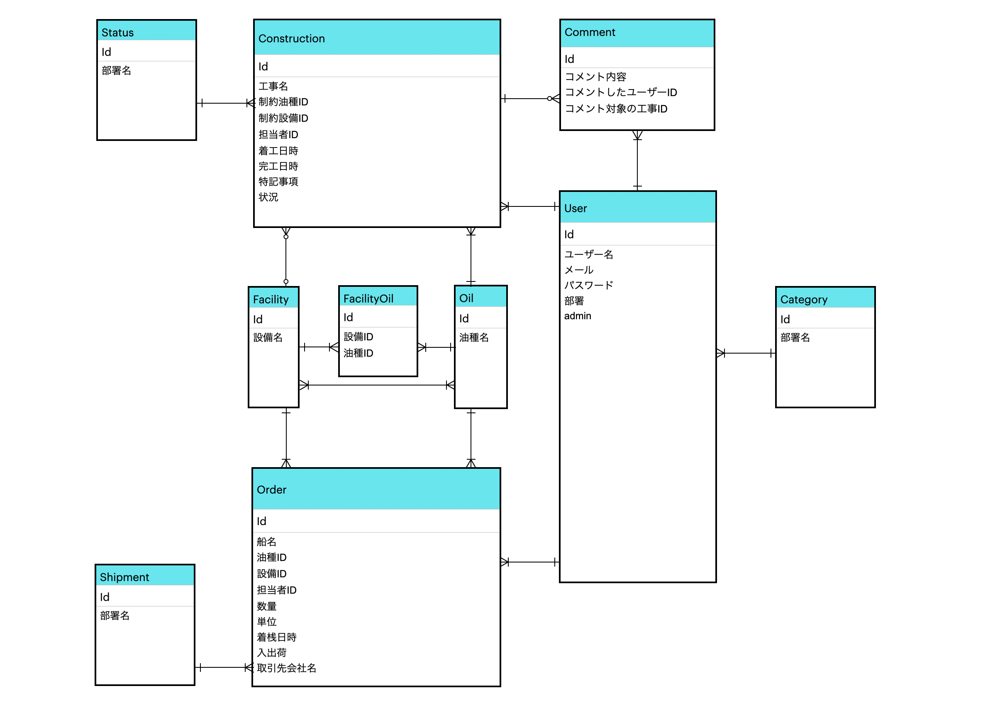

# アプリ概要

[入出荷管理アプリ](https://schedule-app.com "工事-入出荷管理アプリ") 

## 概要
* 石油精製工場の「入出荷船の予定（オーダー）」と「入出荷設備の工事予定」の共有・管理ができるポートフォリオです。
* 前職で「工事の情報や予定の共有が属人的なシステムとなっている」という業務上の不具合が生じていた課題を解決できるソリューションはなにかと考え制作しました。

<!--
[利用シーン例 動画(1:26)](https://www.youtube.com/watch?v=y3dYltsLgz0&list=PLFu1xCObsLPNi-TWiEcojQtsqfrSXi_1q&index=2&t=0s)
※音が出ます。イヤホンが無い方はミュートしてご覧ください。

■ テストユーザーログインも可能ですので、自由にお試しください -->

# 使用技術・言語

- フロントエンド(Javascript, jQuery, HTML/CSS, Sass)
- バックエンド(Ruby on Rails)
- テスト(RSpec, FactoryBot, Capybara)
- Web サーバ(nginx, unicorn)
- データベース(MySQL)
- AWS(VPC, EC2, RDS for MySQL, Route53, ELB, ACM, CloudWatch, CLI)
- 開発環境(MacOS, VScode, Git, GitHub, bash)

# インフラ構成

# DB設計

# 機能要件

### 工事・オーダーの編集

- 工事予定の登録・編集・削除
- オーダーの登録・編集・削除
- カレンダーから登録・編集・削除も可

### 工事・オーダーの閲覧

- 工事予定の一覧表示（pagination）
- オーダーの一覧表示（pagination）
- 各項目によるキーワード検索・ソート・ＣＳＶ出力機能

### 工事へのコメント機能

- コメントの投稿・削除（Ajax）
- 長文コメントへのRead more機能

### カレンダー機能

- 週間・月間カレンダーで工事・オーダーを表示
- 日付クリックで新規工事またはオーダー登録

### ユーザ機能

- ユーザ情報 登録・編集・削除
- マイページ 登録した工事またはオーダー、および投稿コメントの一覧（pagination）
- テストユーザログイン機能

### admin機能

- ユーザー・工事・オーダーを登録・編集・削除（Ajax）
- 入出荷設備の登録・編集・削除、取扱油種との関連付け
- ユーザー・工事・オーダー・入出荷設備の一覧表示（pagination）
- 各項目によるキーワード検索・ソート・CSV出力機能

# 非機能要件

- レスポンシブ対応
- エラーハンドリング
- HTTPS接続
- モデル/コントローラの単体テスト
- 統合テスト

### 工夫した点
* テスト項目(213個)の作成、Git/GitHubでPrefix付きcommit・issue・Pull requestの活用など、チーム開発や保守・運用を意識した開発を行いました
* コメント投稿・削除や、ユーザー詳細情報の切替えなどを、非同期通信でスムーズにできます
* 各情報の一覧画面ではあいまい検索やその検索結果のCSV出力など、実際の運用を想定した機能を作成しました。
* Javascriptを積極的に用いて、フォーム空欄時に送信ボタンのdisable化や、コメントのRead moreなど、UI/UX向上を意識しました。

# アプリ制作について

### テーマ
* 組織で仕事をしていると、情報や予定の共有をいかに効率化するかは、生産性や品質の向上に繋がります。また、他部署の業務に起因する制約などについては「抜け漏れ忘れ」が発生しやすくなります。
* クローズドなコミュニティにおいて、適切な入力制限を課したりコミュニケーションを取りながら、目的に合わせた予定を管理できるアプリを作成しました。

### テーマを選んだ理由
* 前職において工事管理部署と入出荷管理部署の間で、入出荷設備に関する工事についての情報・予定共有が担当者ベースのやり取りのみで行われており、度々入出荷船と工事のバッティングが生じておりました。
* コミュニケーションを取りながら工事の情報を共有し、登録情報に従い適切にオーダー入力制限をかけることをシステム化することで、ヒューマンエラーを未然に防ぎ効率化することができると考え、本アプリを制作しました。

